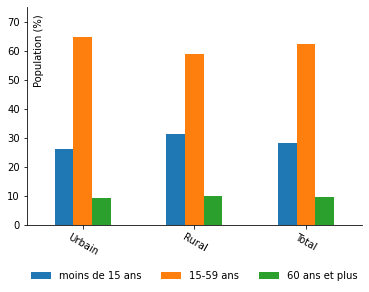
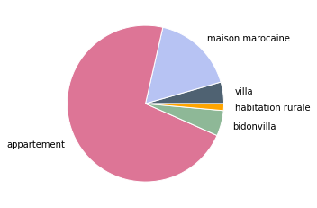
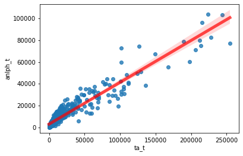
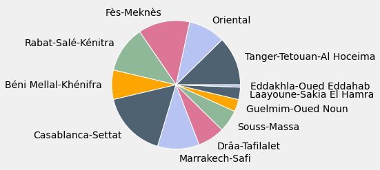
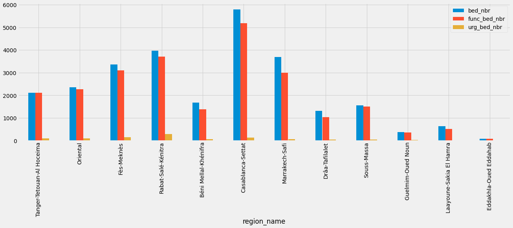
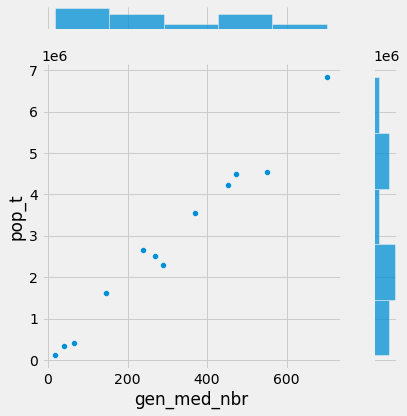
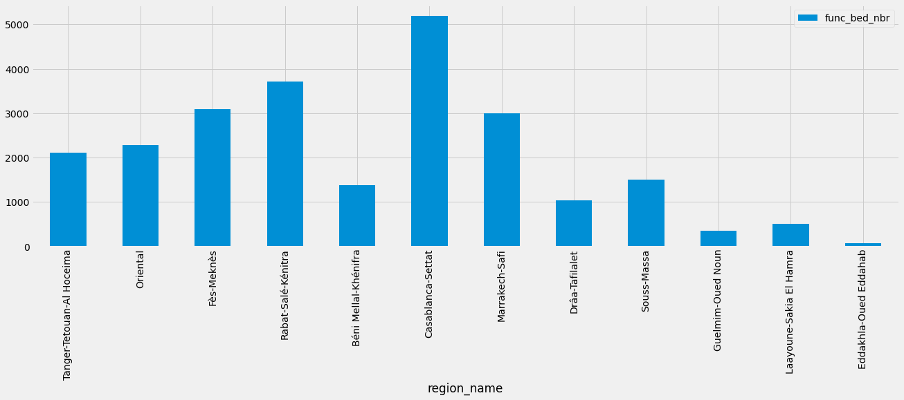

<center>Projet sur le traitement et l’analyse des données du recensement général de la population et de l’habitat de 2014 (RGPH2014) du Maroc</center>


```python
%matplotlib inline
import pandas as pd
import matplotlib.pyplot as plt
import seaborn as sns 
import numpy as np
```

####  1. Créer le fichier notebook et charger dans un DataFrame (dfcom : DataFrame des communes) le contenu de la première feuille du fichier Excel (RGPH2004_2014_Commune.xlsx)


```python
# 1.Chargement dans un DataFramele premières feuille du fichier excel
dfcom=pd.read_excel('RGPH2014_Commune.xlsx', sheet_name="RGPH2014_data")
```


```python
# affichage du 5 premiers lignes pour avoir une idée sur le contenu de la data
dfcom.head()
```


<div>
<style scoped>
    .dataframe tbody tr th:only-of-type {
        vertical-align: middle;
    }

    .dataframe tbody tr th {
        vertical-align: top;
    }

    .dataframe thead th {
        text-align: right;
    }
</style>
<table border="1" class="dataframe">
  <thead>
    <tr style="text-align: right;">
      <th></th>
      <th>OBJECTID</th>
      <th>nom_region</th>
      <th>code_region</th>
      <th>nom_province</th>
      <th>code_province</th>
      <th>nom_cercle</th>
      <th>code_cercle</th>
      <th>nom_commune</th>
      <th>code_commune</th>
      <th>nom_centre</th>
      <th>...</th>
      <th>IPP2004_T</th>
      <th>IPM2004_T</th>
      <th>DPSP_Educ2</th>
      <th>DPSP_sante</th>
      <th>DPSP_AEEA2</th>
      <th>DPSP_Clog2</th>
      <th>DFP_Pmon_u</th>
      <th>DFP_Pmul_u</th>
      <th>DFP_ND_MM_</th>
      <th>TPG2014_T</th>
    </tr>
  </thead>
  <tbody>
    <tr>
      <th>0</th>
      <td>1</td>
      <td>Marrakech-Safi</td>
      <td>7</td>
      <td>Chichaoua</td>
      <td>161</td>
      <td>Chichaoua</td>
      <td>3</td>
      <td>Sid LMokhtar</td>
      <td>16103113</td>
      <td>Sid LMokhtar</td>
      <td>...</td>
      <td>8.457180</td>
      <td>40.777008</td>
      <td>62.889022</td>
      <td>17.733411</td>
      <td>10.804462</td>
      <td>8.573106</td>
      <td>1.41095</td>
      <td>4.68346</td>
      <td>0.783039</td>
      <td>6.877449</td>
    </tr>
    <tr>
      <th>1</th>
      <td>2</td>
      <td>Marrakech-Safi</td>
      <td>7</td>
      <td>Marrakech</td>
      <td>351</td>
      <td>LOUDAYA</td>
      <td>5</td>
      <td>Ait Imour</td>
      <td>35105032</td>
      <td></td>
      <td>...</td>
      <td>11.511656</td>
      <td>41.367142</td>
      <td>67.551315</td>
      <td>13.375796</td>
      <td>4.352441</td>
      <td>14.720453</td>
      <td>2.79230</td>
      <td>7.92297</td>
      <td>0.309491</td>
      <td>11.024761</td>
    </tr>
    <tr>
      <th>2</th>
      <td>3</td>
      <td>Marrakech-Safi</td>
      <td>7</td>
      <td>Essaouira</td>
      <td>211</td>
      <td>TAMANAR</td>
      <td>5</td>
      <td>Bizdad</td>
      <td>21105112</td>
      <td></td>
      <td>...</td>
      <td>30.337774</td>
      <td>45.233658</td>
      <td>62.800479</td>
      <td>7.151443</td>
      <td>15.658388</td>
      <td>14.389691</td>
      <td>6.07098</td>
      <td>21.91380</td>
      <td>4.258560</td>
      <td>32.243340</td>
    </tr>
    <tr>
      <th>3</th>
      <td>4</td>
      <td>Marrakech-Safi</td>
      <td>7</td>
      <td>Essaouira</td>
      <td>211</td>
      <td>TAMANAR</td>
      <td>5</td>
      <td>Bouzemmour</td>
      <td>21105132</td>
      <td></td>
      <td>...</td>
      <td>45.628159</td>
      <td>50.931080</td>
      <td>48.984540</td>
      <td>4.100492</td>
      <td>24.378073</td>
      <td>22.536895</td>
      <td>6.92833</td>
      <td>47.81570</td>
      <td>13.225300</td>
      <td>67.969330</td>
    </tr>
    <tr>
      <th>4</th>
      <td>5</td>
      <td>Marrakech-Safi</td>
      <td>7</td>
      <td>Essaouira</td>
      <td>211</td>
      <td>TAMANAR</td>
      <td>5</td>
      <td>Ezzaouite</td>
      <td>21105152</td>
      <td></td>
      <td>...</td>
      <td>35.322727</td>
      <td>46.790127</td>
      <td>56.600684</td>
      <td>4.678554</td>
      <td>21.244341</td>
      <td>17.476416</td>
      <td>8.37407</td>
      <td>31.93500</td>
      <td>7.285920</td>
      <td>47.594990</td>
    </tr>
  </tbody>
</table>
<p>5 rows × 125 columns</p>
</div>


#### 2. Afficher le nombre de lignes et de colonnes de dfcom


```python
# 2.Affichage de nombre de ligne et colonne
print('On a 1689 lignes et 125 colonnes')
dfcom.shape
```

    On a 1689 lignes et 125 colonnes
    


    (1689, 125)


#### 3. Calculer la population municipale totale, la population masculine, la population féminine et le nombre de ménages du Maroc en 2014


```python
# 3.Calculer la population municipale totale, la population masculine, la population féminine et le nombre de ménages du Maroc en 2014
print('la poulation total, masculine, féminine et le nombre de ménages sont par ordre')
dfcom[['pop_t', 'pop_m','pop_f','NbMg_T']].sum()
```

    la poulation total, masculine, féminine et le nombre de ménages sont par ordre
    


    pop_t     33610084
    pop_m     16747522
    pop_f     16862562
    NbMg_T     7313806
    dtype: int64


#### 4. Afficher les communes dont la population (pop_t) est égale à zéro


```python
# 4.1 Afficher les communes dont la population (pop_t) est égale à zéro.
print('les communes dont la population (pop_t) est égale à zéro.')
dfcom.loc[dfcom['pop_t']==0,['nom_commune','pop_t']]
```

    les communes dont la population (pop_t) est égale à zéro.
    


<div>
<style scoped>
    .dataframe tbody tr th:only-of-type {
        vertical-align: middle;
    }

    .dataframe tbody tr th {
        vertical-align: top;
    }

    .dataframe thead th {
        text-align: right;
    }
</style>
<table border="1" class="dataframe">
  <thead>
    <tr style="text-align: right;">
      <th></th>
      <th>nom_commune</th>
      <th>pop_t</th>
    </tr>
  </thead>
  <tbody>
    <tr>
      <th>1407</th>
      <td>Melilia</td>
      <td>0</td>
    </tr>
    <tr>
      <th>1451</th>
      <td>Sebta</td>
      <td>0</td>
    </tr>
    <tr>
      <th>1676</th>
      <td>Lagouira</td>
      <td>0</td>
    </tr>
    <tr>
      <th>1682</th>
      <td>Zoug</td>
      <td>0</td>
    </tr>
    <tr>
      <th>1683</th>
      <td>Mijik</td>
      <td>0</td>
    </tr>
    <tr>
      <th>1684</th>
      <td>Aghouinite</td>
      <td>0</td>
    </tr>
  </tbody>
</table>
</div>


```python
# 4.2 supprimer définitivement les communes oû la valeur egal 0 de dfcom 
index_Names = dfcom[ dfcom['pop_t'] == 0 ].index
dfcom.drop(index_Names , inplace=True)
```

#### 5.  Ajouter dans dfcom une nouvelle colonne appelée « superficie » et calculer la valeur de cette colonne


```python
# 5.Ajouter dans dfcom une nouvelle colonne appelée « superficie » et calculer la valeur de cette colonne
dfcom['superficie'] = dfcom['pop_t'] / dfcom['densite']  
```

#### 6. Ajouter la colonne « type_commune » à dfcom et calculer sa valeur à partir de la colonne « code_ac » en se basant sur l'enonce


```python
# 6.Ajouter la colonne « type_commune » à dfcom et calculer sa valeur à partir de la colonne « code_ac » en se basant sur la table de correspondance
conditions = [
    (dfcom['code_ac'] == 1),
    (dfcom['code_ac'] == 2),
    (dfcom['code_ac'] == 3),
    (dfcom['code_ac'] == 4),
    (dfcom['code_ac'] == 5)]

values = ['Urbain', 'Rural', 'Centre urbain', 'Centre urbain', 'Centre_urbain']
dfcom['type_commune'] = np.select(conditions, values)
```

#### 7. Calculer le nombre de communes rurales ayant un ou plusieurs centres urbains puis calculer le nombre de communes rurales ayant une population supérieure à la population de leur(s) centre(s) urbain(s)


```python
# 7.Calculer le nombre de communes rurales ayant un ou plusieurs centres urbains
print("le nombre de communes rurales ayant un ou plusieurs centres urbains est de")
dfcom[dfcom['type_commune']=='Centre urbain']['nom_commune'].nunique()
```

    le nombre de communes rurales ayant un ou plusieurs centres urbains est de
    


    146


```python
# 7.calculer le nombre de communes rurales ayant une population supérieure à la population de leur(s) centre(s) urbain(s)
print("le nombre de communes rurales dont la pop_t supérieure à la pop_t de leur(s) centre(s) urbain(s) est de :")
sum(dfcom[dfcom['type_commune']== 'Rural']['pop_t']>dfcom[dfcom['type_commune']== 'Centre urbain']['pop_t'].count())
```

    le nombre de communes rurales dont la pop_t supérieure à la pop_t de leur(s) centre(s) urbain(s) est de :
    


    1274


#### 8. Calculer la moyenne et l’écart-type de la population des communes à caractère urbain (communes de type urbain ou centre urbain) et ceux des communes rurales


```python
# 8.1 Calculer la moyenne de la population des communes à caractère urbain (communes de type urbain ou centre urbain) 
print('la moyenne de la population des communes de type centre urbain ou urbain est de :')
round(dfcom[(['type_commune']=='Centre urbain')|(dfcom['type_commune']=='Urbain')]['pop_t'].mean())
```

    la moyenne de la population des communes de type centre urbain ou urbain est de :
    


    75124


```python
# 8.2 Calculer l’écart-type de la population des communes à caractère urbain (communes de type urbain ou centre urbain) 
print('l’écart-type de la population des communes de type centre urbain ou urbain est de :')
round(dfcom[(['type_commune']=='Centre urbain')|(dfcom['type_commune']=='Urbain')]['pop_t'].std())
```

    l’écart-type de la population des communes de type centre urbain ou urbain est de :
    


    97178


```python
# 8.3 Calculer la moyenne de la population des communes à caractère rural 
print('la moyenne de la population des communes de type centre rural est de :')
round(dfcom[dfcom['type_commune']=='Rural']['pop_t'].mean())
```

    la moyenne de la population des communes de type centre rural est de :
    


    10419


```python
# 8.4 Calculer l’écart-type de la population des communes à caractère rural 
print('l’écart-type de la population des communes de type centre rural est de :')
round(dfcom[dfcom['type_commune']=='Rural']['pop_t'].std())
```

    l’écart-type de la population des communes de type centre rural est de :
    


    7624


#### 9. Calculer le nombre de valeurs uniques dans le champ « nom_commune » et Afficher dans un nouveau dataframe (dfcom_duplic) les communes ayant le même nom tout en affichant le nom de leur province


```python
# 9.1 Calculer le nombre de valeurs uniques dans le champ « nom_commune »
print('le nombre de valeurs uniques dans le champ « nom_commune » ',
dfcom['nom_commune'].nunique())
```

    le nombre de valeurs uniques dans le champ « nom_commune »  1533
    


```python
# 9.Afficher dans un nouveau dataframe (dfcom_duplic) les communes ayant le même nom tout en affichant le nom de leur province
print('les communes ayant le même nom tout en affichant le nom de leur province')
dfcom_duplic=pd.DataFrame(dfcom, columns=['nom_province','nom_commune'])
dfcom_duplic[dfcom_duplic.duplicated(['nom_province','nom_commune'])]
```

    les communes ayant le même nom tout en affichant le nom de leur province
    


<div>
<style scoped>
    .dataframe tbody tr th:only-of-type {
        vertical-align: middle;
    }

    .dataframe tbody tr th {
        vertical-align: top;
    }

    .dataframe thead th {
        text-align: right;
    }
</style>
<table border="1" class="dataframe">
  <thead>
    <tr style="text-align: right;">
      <th></th>
      <th>nom_province</th>
      <th>nom_commune</th>
    </tr>
  </thead>
  <tbody>
    <tr>
      <th>9</th>
      <td>Chichaoua</td>
      <td>Sid LMokhtar</td>
    </tr>
    <tr>
      <th>50</th>
      <td>Essaouira</td>
      <td>Ounagha</td>
    </tr>
    <tr>
      <th>63</th>
      <td>Essaouira</td>
      <td>Tafetachte</td>
    </tr>
    <tr>
      <th>94</th>
      <td>Marrakech</td>
      <td>Harbil</td>
    </tr>
    <tr>
      <th>106</th>
      <td>El Kelaa des  Sraghna</td>
      <td>Assahrij</td>
    </tr>
    <tr>
      <th>...</th>
      <td>...</td>
      <td>...</td>
    </tr>
    <tr>
      <th>1577</th>
      <td>Chefchaouen</td>
      <td>Bab Taza</td>
    </tr>
    <tr>
      <th>1579</th>
      <td>Al Hoceima</td>
      <td>Issaguen</td>
    </tr>
    <tr>
      <th>1600</th>
      <td>Tétouan</td>
      <td>Jbel Lahbib</td>
    </tr>
    <tr>
      <th>1612</th>
      <td>Sidi Ifni</td>
      <td>Mirleft</td>
    </tr>
    <tr>
      <th>1643</th>
      <td>Guelmim</td>
      <td>Taghjijt</td>
    </tr>
  </tbody>
</table>
<p>140 rows × 2 columns</p>
</div>


```python
type(dfcom_duplic)
```


    pandas.core.frame.DataFrame


#### 10. Calculer le nombre de commune dont le nom commence par le terme « Sidi » sans tenir en compte la casse (le terme peut être en minuscule, majuscule ou bien un mélange des deux)


```python
# 10.Calculer le nombre de commune dont le nom commence par le terme « Sidi » sans tenir en compte la casse (le terme peut être en minuscule, majuscule ou bien un mélange des deux)
print('le nombre de commune dont le nom commence par le terme « Sidi » sans tenir en compte la casse est de')
dfcom['nom_commune'].str.upper().str.startswith('SIDI').sum()
```

    le nombre de commune dont le nom commence par le terme « Sidi » sans tenir en compte la casse est de
    


    150


#### 11. Donner le nom de la commune urbaine (code_ac == 1) ayant le taux net d’activité le plus bas et celle ayant le taux net d’activité le plus haut


```python
# 11.Donner le nom de la commune urbaine (code_ac == 1) ayant le taux net d’activité le plus bas et celle ayant le taux net d’activité le plus haut
dfcom[dfcom['ta_t']==dfcom[dfcom["code_ac"] == 1]['ta_t'].min()]['nom_commune']
```


    1092    Ribate El Kheir
    Name: nom_commune, dtype: object


#### 12. Calculer le nombre de communes ayant un taux net d’activité inférieur à la moyenne des taux nets d’activité


```python
type_c1.loc[type_c1['ta_t'] == type_c1['ta_t'].max()]['nom_commune']
```


    1675    El Marsa
    Name: nom_commune, dtype: object


```python
# 12.Calculer le nombre de communes ayant un taux net d’activité inférieur à la moyenne des taux nets d’activit
print("le nombre de communes ayant un taux d'activité inférieur à la moyenne")
sum(dfcom['ta_t']<dfcom['ta_t'].mean())
```

    le nombre de communes ayant un taux d'activité inférieur à la moyenne
    


    843


#### 13.Reproduire à partir des données dfcom, le graphique


```python
dfcom_moins_15=[round(sum(dfcom[dfcom['type_commune']!='Rural']['mq_t']*dfcom[dfcom['type_commune']!='Rural']['pop_t']/100)/sum(dfcom[dfcom['type_commune']!='Rural']['pop_t'])*100,1),
                round(sum(dfcom[dfcom['type_commune']=='Rural']['mq_t']*dfcom[dfcom['type_commune']=='Rural']['pop_t']/100)/sum(dfcom[dfcom['type_commune']=='Rural']['pop_t'])*100,1),
                round(sum(dfcom['mq_t']*dfcom['pop_t']/100)/sum(dfcom['pop_t'])*100,1)]
dfcom_15_à_59=[round(sum(dfcom[dfcom['type_commune']!='Rural']['qcq_t']*dfcom[dfcom['type_commune']!='Rural']['pop_t']/100)/sum(dfcom[dfcom['type_commune']!='Rural']['pop_t'])*100,1),
               round(sum(dfcom[dfcom['type_commune']=='Rural']['qcq_t']*dfcom[dfcom['type_commune']=='Rural']['pop_t']/100)/sum(dfcom[dfcom['type_commune']=='Rural']['pop_t'])*100,1),
               round(sum(dfcom['qcq_t']*dfcom['pop_t']/100)/sum(dfcom['pop_t'])*100,1)]
dfcom_plus_60=[round(sum(dfcom[dfcom['type_commune']!='Rural']['soix_t']*dfcom[dfcom['type_commune']!='Rural']['pop_t']/100)/sum(dfcom[dfcom['type_commune']!='Rural']['pop_t'])*100,1),
               round(sum(dfcom[dfcom['type_commune']=='Rural']['soix_t']*dfcom[dfcom['type_commune']=='Rural']['pop_t']/100)/sum(dfcom[dfcom['type_commune']=='Rural']['pop_t'])*100,1),
               round(sum(dfcom['soix_t']*dfcom['pop_t']/100)/sum(dfcom['pop_t'])*100,1)]

data = {'moins de 15 ans':dfcom_moins_15,
        '15-59 ans':dfcom_15_à_59, 
        '60 ans et plus':dfcom_plus_60}

dtc = pd.DataFrame(data, index =['Urbain',
                                'Rural',
                                'Total'])
dtc=dtc.transpose()

display(dtc)
dtc = pd.DataFrame({'moins de 15 ans': dfcom_moins_15,
                    '15-59 ans':dfcom_15_à_59,
                    '60 ans et plus':dfcom_plus_60,}, index =['Urbain','Rural', 'Total'])
dtc.style.set_caption("Hello World")


ax=dtc.plot.bar()
ax.set_ylabel('Population (%)',fontsize=10)
ax.yaxis.set_label_coords(0.05, .8)
plt.xticks(rotation=-30)
plt.ylim([0, 75])
plt.legend(loc="lower center", bbox_to_anchor=(0.5, -0.3), ncol=3,frameon= False)
ax.spines['top'].set_visible(False)
ax.spines['right'].set_visible(False)
```


<div>
<style scoped>
    .dataframe tbody tr th:only-of-type {
        vertical-align: middle;
    }

    .dataframe tbody tr th {
        vertical-align: top;
    }

    .dataframe thead th {
        text-align: right;
    }
</style>
<table border="1" class="dataframe">
  <thead>
    <tr style="text-align: right;">
      <th></th>
      <th>Urbain</th>
      <th>Rural</th>
      <th>Total</th>
    </tr>
  </thead>
  <tbody>
    <tr>
      <th>moins de 15 ans</th>
      <td>26.1</td>
      <td>31.4</td>
      <td>28.2</td>
    </tr>
    <tr>
      <th>15-59 ans</th>
      <td>64.6</td>
      <td>59.0</td>
      <td>62.4</td>
    </tr>
    <tr>
      <th>60 ans et plus</th>
      <td>9.3</td>
      <td>9.7</td>
      <td>9.4</td>
    </tr>
  </tbody>
</table>
</div>


    

    


#### 14. Représenter graphiquement la répartition des ménages urbains par type d’occupation de logement (villa, maison marocaine, appartement, bidonville, habitation rurale)


```python
dfcom_uvilla=[round(sum(dfcom[dfcom['type_commune']!='Rural']['villa_u']*dfcom[dfcom['type_commune']!='Rural']['pop_t']/100)/sum(dfcom[dfcom['type_commune']!='Rural']['pop_t'])*100,1)]
dfcom_appa_u=[round(sum(dfcom[dfcom['type_commune']!='Rural']['appa_u']*dfcom[dfcom['type_commune']!='Rural']['pop_t']/100)/sum(dfcom[dfcom['type_commune']!='Rural']['pop_t'])*100,1)]
dfcom_mm_u=[round(sum(dfcom[dfcom['type_commune']!='Rural']['mm_u']*dfcom[dfcom['type_commune']!='Rural']['pop_t']/100)/sum(dfcom[dfcom['type_commune']!='Rural']['pop_t'])*100,1)]
dfcom_som_u=[round(sum(dfcom[dfcom['type_commune']!='Rural']['som_u']*dfcom[dfcom['type_commune']!='Rural']['pop_t']/100)/sum(dfcom[dfcom['type_commune']!='Rural']['pop_t'])*100,1)]
dfcom_rural_u=[round(sum(dfcom[dfcom['type_commune']!='Rural']['rural_u']*dfcom[dfcom['type_commune']!='Rural']['pop_t']/100)/sum(dfcom[dfcom['type_commune']!='Rural']['pop_t'])*100,1)]

print("la répartition des ménages urbains par type d’occupation de logement (villa, maison marocaine, appartement, bidonville, habitation rurale)")
data = {'villa':dfcom_uvilla,
        'maison marocaine':dfcom_appa_u, 
        'appartement':dfcom_mm_u,
        'bidonvilla':dfcom_som_u,
        'habitation rurale':dfcom_rural_u}
 
dtu = pd.DataFrame(data, index =['Urbain'])
dtu=dtu.transpose()
display(dtu)

# create random data
names='villa', 'maison marocaine', 'appartement', 'bidonvilla','habitation rurale'
values=[4.4,16.8,71.1,5.2,1.4]

# Label distance: gives the space between labels and the center of the pie
colors = ['#4F6272', '#B7C3F3', '#DD7596', '#8EB897', '#FFA500']
plt.pie(values, labels=names, labeldistance=1.15,wedgeprops = { 'linewidth' : 1, 'edgecolor' : 'white' }, colors=colors);
plt.show();
```

    la répartition des ménages urbains par type d’occupation de logement (villa, maison marocaine, appartement, bidonville, habitation rurale)
    


<div>
<style scoped>
    .dataframe tbody tr th:only-of-type {
        vertical-align: middle;
    }

    .dataframe tbody tr th {
        vertical-align: top;
    }

    .dataframe thead th {
        text-align: right;
    }
</style>
<table border="1" class="dataframe">
  <thead>
    <tr style="text-align: right;">
      <th></th>
      <th>Urbain</th>
    </tr>
  </thead>
  <tbody>
    <tr>
      <th>villa</th>
      <td>4.4</td>
    </tr>
    <tr>
      <th>maison marocaine</th>
      <td>16.8</td>
    </tr>
    <tr>
      <th>appartement</th>
      <td>71.1</td>
    </tr>
    <tr>
      <th>bidonvilla</th>
      <td>5.2</td>
    </tr>
    <tr>
      <th>habitation rurale</th>
      <td>1.4</td>
    </tr>
  </tbody>
</table>
</div>


    

    


####  15. Représenter graphiquement le taux net d’activité (ta_t) en fonction du taux d’analphabétisme de la population âgée de 10 ans et plus (anlph_t). Commenter le graphique


```python
print("representation graphique de taux net d’activité en fonction du taux d’analphabétisme de la population âgée de 10 ans et plus")
anlph_t=round(dfcom['pop_t']*dfcom['anlph_t']/100,1)
ta_t=round(dfcom['pop_t']*dfcom['ta_t']/100,1)


data = {'ta_t':ta_t,
        'anlph_t':anlph_t}
 
dtt = pd.DataFrame(data)

display(dtt)
sns.regplot(dtt["ta_t"], dtt["anlph_t"], line_kws={"color":"r","alpha":0.7,"lw":5})
plt.show()
### on voie que le taux
```

    representation graphique de taux net d’activité en fonction du taux d’analphabétisme de la population âgée de 10 ans et plus
    


<div>
<style scoped>
    .dataframe tbody tr th:only-of-type {
        vertical-align: middle;
    }

    .dataframe tbody tr th {
        vertical-align: top;
    }

    .dataframe thead th {
        text-align: right;
    }
</style>
<table border="1" class="dataframe">
  <thead>
    <tr style="text-align: right;">
      <th></th>
      <th>ta_t</th>
      <th>anlph_t</th>
    </tr>
  </thead>
  <tbody>
    <tr>
      <th>0</th>
      <td>6491.6</td>
      <td>5204.4</td>
    </tr>
    <tr>
      <th>1</th>
      <td>6343.2</td>
      <td>6678.4</td>
    </tr>
    <tr>
      <th>2</th>
      <td>3091.7</td>
      <td>4735.8</td>
    </tr>
    <tr>
      <th>3</th>
      <td>2328.5</td>
      <td>3599.2</td>
    </tr>
    <tr>
      <th>4</th>
      <td>2467.0</td>
      <td>3945.9</td>
    </tr>
    <tr>
      <th>...</th>
      <td>...</td>
      <td>...</td>
    </tr>
    <tr>
      <th>1681</th>
      <td>40.0</td>
      <td>20.0</td>
    </tr>
    <tr>
      <th>1685</th>
      <td>351.2</td>
      <td>146.9</td>
    </tr>
    <tr>
      <th>1686</th>
      <td>58758.7</td>
      <td>21500.6</td>
    </tr>
    <tr>
      <th>1687</th>
      <td>22.1</td>
      <td>4.3</td>
    </tr>
    <tr>
      <th>1688</th>
      <td>1617.3</td>
      <td>437.6</td>
    </tr>
  </tbody>
</table>
<p>1683 rows × 2 columns</p>
</div>


    C:\Users\lenovo\anaconda3\lib\site-packages\seaborn\_decorators.py:36: FutureWarning: Pass the following variables as keyword args: x, y. From version 0.12, the only valid positional argument will be `data`, and passing other arguments without an explicit keyword will result in an error or misinterpretation.
      warnings.warn(
    


    

    


#### 16. D’après les données représentées dans dfcom, quels sont les facteurs explicatifs du taux de pauvreté globale. Est-ce que ces facteurs sont les mêmes en milieu urbain et en milieu rural ?


```python
# Les facteurs explicatifs du taux de pauvreté globale
d_corr=dfcom.corr()
threshold=0.8
haut_corr=abs(d_corr['TPG2014_T'])
result=haut_corr[haut_corr>0.8]
result
```


    TPMulti201    0.953661
    IPP2014_T     0.946647
    IPP2004_T     0.810343
    DFP_Pmul_u    0.895435
    DFP_ND_MM_    0.837535
    TPG2014_T     1.000000
    Name: TPG2014_T, dtype: float64


```python
# 16.2 Est-ce que ces facteurs sont les mêmes en milieu urbain et en milieu rural ?
# la correltaion entre "TPG2014_T" et les autres varibales dans le mlieu Urbain
corr_ur=dfcom[dfcom['type_commune']!='Rural'].corr()['TPG2014_T'][:]
Threshold=0.8
haut_cru=corr_ur[corr_ur>0.8]
haut_cru
```


    pauv2014_T    0.964360
    volum_T       0.951003
    sev_T         0.923734
    vul_T         0.844052
    DFP_Pmon_u    0.950484
    TPG2014_T     1.000000
    Name: TPG2014_T, dtype: float64


```python
# la correltaion entre "TPG2014_T" et les autres varibales dans le mlieu Rural
corr_ru=dfcom[dfcom['type_commune']=='Rural'].corr()['TPG2014_T'][:]
Threshold=0.8
haut_cru=corr_ru[corr_ru>0.8]
haut_cru
```


    TPMulti201    0.948155
    IPP2014_T     0.942192
    DFP_Pmul_u    0.867144
    DFP_ND_MM_    0.833718
    TPG2014_T     1.000000
    Name: TPG2014_T, dtype: float64


```python
# les variables qui impact directement le taux de pauvreté dans le milieu rural sont dirrerents que celles du mulieu urbain on a 
pour le milieu Urbian les facteurs suivants
            pauv2014_T   =  Taux de pauvreté monétaire (Total)
            volum_T       0.951003
            sev_T         0.923734
            vul_T         0.844052
            DFP_Pmon_u    0.950484
```

#### 17. Générer un nouveau DataFrame (DataFrame des Provinces : dfprov)


```python
# definir les colonnes puis gnérer les données
dfprov = dfcom[['code_province','nom_province','pop_t','pop_m','pop_f','NbMg_T','eau_t','elec_t']].copy()
dfprov['nb_com_u'] = dfcom['type_commune']!= 'Rural'
dfprov['nb_com_r'] = dfcom['type_commune']== 'Rural'
dfprov['nb_com_u'] = dfprov['nb_com_u'].astype(int)
dfprov['nb_com_r'] = dfprov['nb_com_r'].astype(int)
dfprov['pop_u']=dfcom[dfcom['type_commune']!='Rural']['pop_t']
dfprov['pop_r']=dfcom[dfcom['type_commune']=='Rural']['pop_t']
dfprov['NbMg_U']=dfcom[dfcom['type_commune']!='Rural']['NbMg_T']
dfprov['NbMg_R']=dfcom[dfcom['type_commune']=='Rural']['NbMg_T']
dfprov
```


<div>
<style scoped>
    .dataframe tbody tr th:only-of-type {
        vertical-align: middle;
    }

    .dataframe tbody tr th {
        vertical-align: top;
    }

    .dataframe thead th {
        text-align: right;
    }
</style>
<table border="1" class="dataframe">
  <thead>
    <tr style="text-align: right;">
      <th></th>
      <th>code_province</th>
      <th>nom_province</th>
      <th>pop_t</th>
      <th>pop_m</th>
      <th>pop_f</th>
      <th>NbMg_T</th>
      <th>eau_t</th>
      <th>elec_t</th>
      <th>nb_com_u</th>
      <th>nb_com_r</th>
      <th>pop_u</th>
      <th>pop_r</th>
      <th>NbMg_U</th>
      <th>NbMg_R</th>
    </tr>
  </thead>
  <tbody>
    <tr>
      <th>0</th>
      <td>161</td>
      <td>Chichaoua</td>
      <td>13537</td>
      <td>6586</td>
      <td>6951</td>
      <td>3042</td>
      <td>91.381579</td>
      <td>91.019737</td>
      <td>1</td>
      <td>0</td>
      <td>13537.0</td>
      <td>NaN</td>
      <td>3042.0</td>
      <td>NaN</td>
    </tr>
    <tr>
      <th>1</th>
      <td>351</td>
      <td>Marrakech</td>
      <td>14544</td>
      <td>7525</td>
      <td>7019</td>
      <td>2767</td>
      <td>91.507047</td>
      <td>95.627033</td>
      <td>0</td>
      <td>1</td>
      <td>NaN</td>
      <td>14544.0</td>
      <td>NaN</td>
      <td>2767.0</td>
    </tr>
    <tr>
      <th>2</th>
      <td>211</td>
      <td>Essaouira</td>
      <td>7890</td>
      <td>3845</td>
      <td>4045</td>
      <td>1604</td>
      <td>71.134663</td>
      <td>81.608479</td>
      <td>0</td>
      <td>1</td>
      <td>NaN</td>
      <td>7890.0</td>
      <td>NaN</td>
      <td>1604.0</td>
    </tr>
    <tr>
      <th>3</th>
      <td>211</td>
      <td>Essaouira</td>
      <td>5860</td>
      <td>2834</td>
      <td>3026</td>
      <td>1066</td>
      <td>0.000000</td>
      <td>57.973734</td>
      <td>0</td>
      <td>1</td>
      <td>NaN</td>
      <td>5860.0</td>
      <td>NaN</td>
      <td>1066.0</td>
    </tr>
    <tr>
      <th>4</th>
      <td>211</td>
      <td>Essaouira</td>
      <td>6341</td>
      <td>3046</td>
      <td>3295</td>
      <td>1220</td>
      <td>54.426230</td>
      <td>67.540984</td>
      <td>0</td>
      <td>1</td>
      <td>NaN</td>
      <td>6341.0</td>
      <td>NaN</td>
      <td>1220.0</td>
    </tr>
    <tr>
      <th>...</th>
      <td>...</td>
      <td>...</td>
      <td>...</td>
      <td>...</td>
      <td>...</td>
      <td>...</td>
      <td>...</td>
      <td>...</td>
      <td>...</td>
      <td>...</td>
      <td>...</td>
      <td>...</td>
      <td>...</td>
      <td>...</td>
    </tr>
    <tr>
      <th>1681</th>
      <td>66</td>
      <td>Aousserd</td>
      <td>40</td>
      <td>40</td>
      <td>0</td>
      <td>14</td>
      <td>16.666667</td>
      <td>41.666667</td>
      <td>0</td>
      <td>1</td>
      <td>NaN</td>
      <td>40.0</td>
      <td>NaN</td>
      <td>14.0</td>
    </tr>
    <tr>
      <th>1685</th>
      <td>66</td>
      <td>Aousserd</td>
      <td>424</td>
      <td>316</td>
      <td>108</td>
      <td>154</td>
      <td>22.137405</td>
      <td>90.076336</td>
      <td>0</td>
      <td>1</td>
      <td>NaN</td>
      <td>424.0</td>
      <td>NaN</td>
      <td>154.0</td>
    </tr>
    <tr>
      <th>1686</th>
      <td>391</td>
      <td>Oued-Ed-Dahab</td>
      <td>102098</td>
      <td>55164</td>
      <td>46934</td>
      <td>25469</td>
      <td>94.779432</td>
      <td>94.363044</td>
      <td>1</td>
      <td>0</td>
      <td>102098.0</td>
      <td>NaN</td>
      <td>25469.0</td>
      <td>NaN</td>
    </tr>
    <tr>
      <th>1687</th>
      <td>391</td>
      <td>Oued-Ed-Dahab</td>
      <td>32</td>
      <td>24</td>
      <td>8</td>
      <td>18</td>
      <td>0.000000</td>
      <td>0.000000</td>
      <td>0</td>
      <td>1</td>
      <td>NaN</td>
      <td>32.0</td>
      <td>NaN</td>
      <td>18.0</td>
    </tr>
    <tr>
      <th>1688</th>
      <td>66</td>
      <td>Aousserd</td>
      <td>1932</td>
      <td>1480</td>
      <td>452</td>
      <td>608</td>
      <td>53.973510</td>
      <td>58.940397</td>
      <td>0</td>
      <td>1</td>
      <td>NaN</td>
      <td>1932.0</td>
      <td>NaN</td>
      <td>608.0</td>
    </tr>
  </tbody>
</table>
<p>1683 rows × 14 columns</p>
</div>


```python
# agregation par code de province
dfprov.groupby('code_province')
by_code_province=dfprov.groupby('code_province')
by_code_province.sum()
```


<div>
<style scoped>
    .dataframe tbody tr th:only-of-type {
        vertical-align: middle;
    }

    .dataframe tbody tr th {
        vertical-align: top;
    }

    .dataframe thead th {
        text-align: right;
    }
</style>
<table border="1" class="dataframe">
  <thead>
    <tr style="text-align: right;">
      <th></th>
      <th>pop_t</th>
      <th>pop_m</th>
      <th>pop_f</th>
      <th>NbMg_T</th>
      <th>eau_t</th>
      <th>elec_t</th>
      <th>nb_com_u</th>
      <th>nb_com_r</th>
      <th>pop_u</th>
      <th>pop_r</th>
      <th>NbMg_U</th>
      <th>NbMg_R</th>
    </tr>
    <tr>
      <th>code_province</th>
      <th></th>
      <th></th>
      <th></th>
      <th></th>
      <th></th>
      <th></th>
      <th></th>
      <th></th>
      <th></th>
      <th></th>
      <th></th>
      <th></th>
    </tr>
  </thead>
  <tbody>
    <tr>
      <th>1</th>
      <td>598757</td>
      <td>301264</td>
      <td>297493</td>
      <td>143752</td>
      <td>788.087046</td>
      <td>1310.755672</td>
      <td>3</td>
      <td>12</td>
      <td>506517.0</td>
      <td>92240.0</td>
      <td>124107.0</td>
      <td>19645.0</td>
    </tr>
    <tr>
      <th>41</th>
      <td>571999</td>
      <td>291795</td>
      <td>280204</td>
      <td>111627</td>
      <td>3601.092779</td>
      <td>4204.858609</td>
      <td>8</td>
      <td>37</td>
      <td>84205.0</td>
      <td>487794.0</td>
      <td>18845.0</td>
      <td>92782.0</td>
    </tr>
    <tr>
      <th>51</th>
      <td>397708</td>
      <td>198506</td>
      <td>199202</td>
      <td>79326</td>
      <td>1234.950694</td>
      <td>3658.065471</td>
      <td>9</td>
      <td>31</td>
      <td>135840.0</td>
      <td>261868.0</td>
      <td>32010.0</td>
      <td>47316.0</td>
    </tr>
    <tr>
      <th>61</th>
      <td>827479</td>
      <td>408004</td>
      <td>419475</td>
      <td>192654</td>
      <td>1725.360463</td>
      <td>2353.317581</td>
      <td>12</td>
      <td>15</td>
      <td>684484.0</td>
      <td>142995.0</td>
      <td>164167.0</td>
      <td>28487.0</td>
    </tr>
    <tr>
      <th>66</th>
      <td>2396</td>
      <td>1836</td>
      <td>560</td>
      <td>776</td>
      <td>92.777582</td>
      <td>190.683400</td>
      <td>0</td>
      <td>3</td>
      <td>0.0</td>
      <td>2396.0</td>
      <td>0.0</td>
      <td>776.0</td>
    </tr>
    <tr>
      <th>...</th>
      <td>...</td>
      <td>...</td>
      <td>...</td>
      <td>...</td>
      <td>...</td>
      <td>...</td>
      <td>...</td>
      <td>...</td>
      <td>...</td>
      <td>...</td>
      <td>...</td>
      <td>...</td>
    </tr>
    <tr>
      <th>577</th>
      <td>321184</td>
      <td>158603</td>
      <td>162581</td>
      <td>49990</td>
      <td>2143.690487</td>
      <td>2353.929934</td>
      <td>4</td>
      <td>22</td>
      <td>75007.0</td>
      <td>246177.0</td>
      <td>14041.0</td>
      <td>35949.0</td>
    </tr>
    <tr>
      <th>581</th>
      <td>205182</td>
      <td>95875</td>
      <td>109307</td>
      <td>51142</td>
      <td>1372.313811</td>
      <td>2349.779236</td>
      <td>2</td>
      <td>23</td>
      <td>80400.0</td>
      <td>124782.0</td>
      <td>20191.0</td>
      <td>30951.0</td>
    </tr>
    <tr>
      <th>585</th>
      <td>251943</td>
      <td>128372</td>
      <td>123571</td>
      <td>45030</td>
      <td>346.076510</td>
      <td>1101.872526</td>
      <td>4</td>
      <td>9</td>
      <td>100883.0</td>
      <td>151060.0</td>
      <td>21518.0</td>
      <td>23512.0</td>
    </tr>
    <tr>
      <th>587</th>
      <td>305510</td>
      <td>149094</td>
      <td>156416</td>
      <td>38067</td>
      <td>2087.553459</td>
      <td>2268.060687</td>
      <td>2</td>
      <td>23</td>
      <td>50668.0</td>
      <td>254842.0</td>
      <td>8197.0</td>
      <td>29870.0</td>
    </tr>
    <tr>
      <th>591</th>
      <td>172311</td>
      <td>88071</td>
      <td>84240</td>
      <td>31338</td>
      <td>329.783304</td>
      <td>1039.841345</td>
      <td>2</td>
      <td>10</td>
      <td>23383.0</td>
      <td>148928.0</td>
      <td>5086.0</td>
      <td>26252.0</td>
    </tr>
  </tbody>
</table>
<p>75 rows × 12 columns</p>
</div>


#### générer un nouveau DataFrame (DataFrame des Régions : dfreg) qui donne les mêmes informations indiquées ci-dessus en remplaçant l’agrégat province par région (agrégation par code_region)


```python
# remplaçant le code de province par code de la region
dfreg=dfprov
dfreg['code_province'] = dfcom['code_region']
dfreg.rename( columns={'code_province':'code_region'} ,inplace=True)
dfreg
```


<div>
<style scoped>
    .dataframe tbody tr th:only-of-type {
        vertical-align: middle;
    }

    .dataframe tbody tr th {
        vertical-align: top;
    }

    .dataframe thead th {
        text-align: right;
    }
</style>
<table border="1" class="dataframe">
  <thead>
    <tr style="text-align: right;">
      <th></th>
      <th>code_region</th>
      <th>nom_province</th>
      <th>pop_t</th>
      <th>pop_m</th>
      <th>pop_f</th>
      <th>NbMg_T</th>
      <th>eau_t</th>
      <th>elec_t</th>
      <th>nb_com_u</th>
      <th>nb_com_r</th>
      <th>pop_u</th>
      <th>pop_r</th>
      <th>NbMg_U</th>
      <th>NbMg_R</th>
    </tr>
  </thead>
  <tbody>
    <tr>
      <th>0</th>
      <td>7</td>
      <td>Chichaoua</td>
      <td>13537</td>
      <td>6586</td>
      <td>6951</td>
      <td>3042</td>
      <td>91.381579</td>
      <td>91.019737</td>
      <td>1</td>
      <td>0</td>
      <td>13537.0</td>
      <td>NaN</td>
      <td>3042.0</td>
      <td>NaN</td>
    </tr>
    <tr>
      <th>1</th>
      <td>7</td>
      <td>Marrakech</td>
      <td>14544</td>
      <td>7525</td>
      <td>7019</td>
      <td>2767</td>
      <td>91.507047</td>
      <td>95.627033</td>
      <td>0</td>
      <td>1</td>
      <td>NaN</td>
      <td>14544.0</td>
      <td>NaN</td>
      <td>2767.0</td>
    </tr>
    <tr>
      <th>2</th>
      <td>7</td>
      <td>Essaouira</td>
      <td>7890</td>
      <td>3845</td>
      <td>4045</td>
      <td>1604</td>
      <td>71.134663</td>
      <td>81.608479</td>
      <td>0</td>
      <td>1</td>
      <td>NaN</td>
      <td>7890.0</td>
      <td>NaN</td>
      <td>1604.0</td>
    </tr>
    <tr>
      <th>3</th>
      <td>7</td>
      <td>Essaouira</td>
      <td>5860</td>
      <td>2834</td>
      <td>3026</td>
      <td>1066</td>
      <td>0.000000</td>
      <td>57.973734</td>
      <td>0</td>
      <td>1</td>
      <td>NaN</td>
      <td>5860.0</td>
      <td>NaN</td>
      <td>1066.0</td>
    </tr>
    <tr>
      <th>4</th>
      <td>7</td>
      <td>Essaouira</td>
      <td>6341</td>
      <td>3046</td>
      <td>3295</td>
      <td>1220</td>
      <td>54.426230</td>
      <td>67.540984</td>
      <td>0</td>
      <td>1</td>
      <td>NaN</td>
      <td>6341.0</td>
      <td>NaN</td>
      <td>1220.0</td>
    </tr>
    <tr>
      <th>...</th>
      <td>...</td>
      <td>...</td>
      <td>...</td>
      <td>...</td>
      <td>...</td>
      <td>...</td>
      <td>...</td>
      <td>...</td>
      <td>...</td>
      <td>...</td>
      <td>...</td>
      <td>...</td>
      <td>...</td>
      <td>...</td>
    </tr>
    <tr>
      <th>1681</th>
      <td>12</td>
      <td>Aousserd</td>
      <td>40</td>
      <td>40</td>
      <td>0</td>
      <td>14</td>
      <td>16.666667</td>
      <td>41.666667</td>
      <td>0</td>
      <td>1</td>
      <td>NaN</td>
      <td>40.0</td>
      <td>NaN</td>
      <td>14.0</td>
    </tr>
    <tr>
      <th>1685</th>
      <td>12</td>
      <td>Aousserd</td>
      <td>424</td>
      <td>316</td>
      <td>108</td>
      <td>154</td>
      <td>22.137405</td>
      <td>90.076336</td>
      <td>0</td>
      <td>1</td>
      <td>NaN</td>
      <td>424.0</td>
      <td>NaN</td>
      <td>154.0</td>
    </tr>
    <tr>
      <th>1686</th>
      <td>12</td>
      <td>Oued-Ed-Dahab</td>
      <td>102098</td>
      <td>55164</td>
      <td>46934</td>
      <td>25469</td>
      <td>94.779432</td>
      <td>94.363044</td>
      <td>1</td>
      <td>0</td>
      <td>102098.0</td>
      <td>NaN</td>
      <td>25469.0</td>
      <td>NaN</td>
    </tr>
    <tr>
      <th>1687</th>
      <td>12</td>
      <td>Oued-Ed-Dahab</td>
      <td>32</td>
      <td>24</td>
      <td>8</td>
      <td>18</td>
      <td>0.000000</td>
      <td>0.000000</td>
      <td>0</td>
      <td>1</td>
      <td>NaN</td>
      <td>32.0</td>
      <td>NaN</td>
      <td>18.0</td>
    </tr>
    <tr>
      <th>1688</th>
      <td>12</td>
      <td>Aousserd</td>
      <td>1932</td>
      <td>1480</td>
      <td>452</td>
      <td>608</td>
      <td>53.973510</td>
      <td>58.940397</td>
      <td>0</td>
      <td>1</td>
      <td>NaN</td>
      <td>1932.0</td>
      <td>NaN</td>
      <td>608.0</td>
    </tr>
  </tbody>
</table>
<p>1683 rows × 14 columns</p>
</div>


```python
# agregation par code _region
dfprov.groupby('code_region')
by_code_region=dfprov.groupby('code_region')
dfreg=by_code_region.sum()
dfreg
```


<div>
<style scoped>
    .dataframe tbody tr th:only-of-type {
        vertical-align: middle;
    }

    .dataframe tbody tr th {
        vertical-align: top;
    }

    .dataframe thead th {
        text-align: right;
    }
</style>
<table border="1" class="dataframe">
  <thead>
    <tr style="text-align: right;">
      <th></th>
      <th>pop_t</th>
      <th>pop_m</th>
      <th>pop_f</th>
      <th>NbMg_T</th>
      <th>eau_t</th>
      <th>elec_t</th>
      <th>nb_com_u</th>
      <th>nb_com_r</th>
      <th>pop_u</th>
      <th>pop_r</th>
      <th>NbMg_U</th>
      <th>NbMg_R</th>
    </tr>
    <tr>
      <th>code_region</th>
      <th></th>
      <th></th>
      <th></th>
      <th></th>
      <th></th>
      <th></th>
      <th></th>
      <th></th>
      <th></th>
      <th></th>
      <th></th>
      <th></th>
    </tr>
  </thead>
  <tbody>
    <tr>
      <th>1</th>
      <td>3540012</td>
      <td>1795813</td>
      <td>1744199</td>
      <td>799124</td>
      <td>4740.377791</td>
      <td>14942.332928</td>
      <td>37</td>
      <td>129</td>
      <td>2120666.0</td>
      <td>1419346.0</td>
      <td>525168.0</td>
      <td>273956.0</td>
    </tr>
    <tr>
      <th>2</th>
      <td>2302182</td>
      <td>1141574</td>
      <td>1160608</td>
      <td>494530</td>
      <td>5955.947281</td>
      <td>10958.531789</td>
      <td>43</td>
      <td>96</td>
      <td>1504517.0</td>
      <td>797665.0</td>
      <td>338419.0</td>
      <td>156111.0</td>
    </tr>
    <tr>
      <th>3</th>
      <td>4216957</td>
      <td>2088237</td>
      <td>2128720</td>
      <td>919497</td>
      <td>9657.239579</td>
      <td>19316.404954</td>
      <td>65</td>
      <td>161</td>
      <td>2549791.0</td>
      <td>1667166.0</td>
      <td>600113.0</td>
      <td>319384.0</td>
    </tr>
    <tr>
      <th>4</th>
      <td>4552585</td>
      <td>2262836</td>
      <td>2289749</td>
      <td>1015107</td>
      <td>5687.297054</td>
      <td>11278.417035</td>
      <td>46</td>
      <td>91</td>
      <td>3172955.0</td>
      <td>1379630.0</td>
      <td>766852.0</td>
      <td>248255.0</td>
    </tr>
    <tr>
      <th>5</th>
      <td>2512375</td>
      <td>1236817</td>
      <td>1275558</td>
      <td>520174</td>
      <td>7652.709982</td>
      <td>11652.997545</td>
      <td>38</td>
      <td>119</td>
      <td>1233846.0</td>
      <td>1278529.0</td>
      <td>287268.0</td>
      <td>232906.0</td>
    </tr>
    <tr>
      <th>6</th>
      <td>6826773</td>
      <td>3414102</td>
      <td>3412671</td>
      <td>1559404</td>
      <td>6748.428670</td>
      <td>16298.057058</td>
      <td>58</td>
      <td>124</td>
      <td>5022475.0</td>
      <td>1804298.0</td>
      <td>1214427.0</td>
      <td>344977.0</td>
    </tr>
    <tr>
      <th>7</th>
      <td>4504767</td>
      <td>2267818</td>
      <td>2236949</td>
      <td>928120</td>
      <td>15535.340164</td>
      <td>24078.518361</td>
      <td>47</td>
      <td>228</td>
      <td>1928525.0</td>
      <td>2576242.0</td>
      <td>444856.0</td>
      <td>483264.0</td>
    </tr>
    <tr>
      <th>8</th>
      <td>1627269</td>
      <td>796405</td>
      <td>830864</td>
      <td>277998</td>
      <td>10207.204027</td>
      <td>12110.369184</td>
      <td>26</td>
      <td>109</td>
      <td>555461.0</td>
      <td>1071808.0</td>
      <td>114631.0</td>
      <td>163367.0</td>
    </tr>
    <tr>
      <th>9</th>
      <td>2657906</td>
      <td>1300313</td>
      <td>1357593</td>
      <td>601511</td>
      <td>11831.561576</td>
      <td>16304.803950</td>
      <td>28</td>
      <td>154</td>
      <td>1493198.0</td>
      <td>1164708.0</td>
      <td>353802.0</td>
      <td>247709.0</td>
    </tr>
    <tr>
      <th>10</th>
      <td>414489</td>
      <td>201862</td>
      <td>212627</td>
      <td>90202</td>
      <td>3054.504658</td>
      <td>4358.552301</td>
      <td>10</td>
      <td>45</td>
      <td>270419.0</td>
      <td>144070.0</td>
      <td>60873.0</td>
      <td>29329.0</td>
    </tr>
    <tr>
      <th>11</th>
      <td>340748</td>
      <td>175687</td>
      <td>165061</td>
      <td>78754</td>
      <td>915.909750</td>
      <td>1082.083786</td>
      <td>5</td>
      <td>15</td>
      <td>330485.0</td>
      <td>10263.0</td>
      <td>75865.0</td>
      <td>2889.0</td>
    </tr>
    <tr>
      <th>12</th>
      <td>114021</td>
      <td>66058</td>
      <td>47963</td>
      <td>29385</td>
      <td>201.026166</td>
      <td>304.641179</td>
      <td>1</td>
      <td>8</td>
      <td>102098.0</td>
      <td>11923.0</td>
      <td>25469.0</td>
      <td>3916.0</td>
    </tr>
  </tbody>
</table>
</div>


#### 18.En faisant le webscraping du site web (http://cartesanitaire.sante.gov.ma) ajouter à dfreg, les informations suivantes (données par région) 


```python
import requests 
from bs4 import BeautifulSoup
url = "http://cartesanitaire.sante.gov.ma/ftnrd?p_idniveau=4&p_idreg=6"
res = requests.get(url)
soup = BeautifulSoup(res.text, 'html.parser')
res
```


    <Response [200]>


```python
tables = soup.find_all("table")  # returns a list of tables
print(f'Total tables: {len(tables)}')
dfh=tables
```

    Total tables: 18
    

#### 18.1 le webscraping du site web (http://cartesanitaire.sante.gov.ma) 


```python
# copie html dans un editeur de text pour cerner les position de chaque table pouis generer les avec une loup
col_names=["region_name",
           "hosp_nbr","bed_nbr",
           "func_bed_nbr","hémo_center_nbr",
           "urg_bed_nbr","clinic_nbr",
           "offic_nbr","cab_nbr",
           "gen_med_nbr","spec_med_nbr",
           "phar_med_nbr",
           "chir_med_nbr","cor_med_nbr"]
dfm_reg=pd.DataFrame(columns=col_names)


for i in range(1,13):
    # get the url :
    url = f"http://cartesanitaire.sante.gov.ma/ftnrd?p_idniveau=4&p_idreg={i}"
    req = requests.get(url)
    soup = BeautifulSoup(req.text, 'html.parser')
    #region name
    region_name=soup.find("span",{"id":"lblRegion"}).text.split(":")[1].strip()
    #Nbr d’hôpitaux et nbr de lits existants et nbr de lits fonctionnels
    hosp_table=soup.find_all("table",{"class":"table table-bordered"})[4]
    for hosp in hosp_table.find_all("tbody"):
        rows=hosp.find_all("tr")
        hosp_nbr=rows[-1].find_all("td",{"style":"text-align: center"})[0].text
        bed_nbr=rows[-1].find_all("td",{"style":"text-align: center"})[1].text
        func_bed_nbr=rows[-1].find_all("td",{"style":"text-align: center"})[2].text
    # nbr centres d’hémodialyse
    hémo_center=soup.find_all("table",{"class":"table table-bordered"})[5]
    for center in hémo_center.find_all("tbody"):
        rows=center.find_all("tr")
        hémo_center_nbr=rows[0].find("td",{"style":"text-align: center"}).text
    # nbr lit d’urgence
    urg_bed=soup.find_all("table",{"class":"table table-bordered"})[9]
    for urg in urg_bed.find_all("tbody"):
        rows=urg.find_all("tr")
        urg_bed_nbr=rows[-1].find_all("td",{"style":"text-align: center"})[1].text
    # nbr cliniques, officines de pharmacie et laboratoire
    clin_table=soup.find_all("table",{"class":"table table-bordered"})[12]
    for clin in clin_table.find_all("tbody"):
        rows=clin.find_all("tr")
        clinic_nbr=rows[0].find("td",{"style":"text-align: center"}).text
        offic_nbr=rows[4].find("td",{"style":"text-align: center"}).text
        cab_nbr=rows[3].find("td",{"style":"text-align: center"}).text
    # med generalistes, specialiste, phamacistes, chirurgien dentistes, et corps médical
    med_table=soup.find_all("table",{"class":"table table-bordered"})[14]
    for med in med_table.find_all("tbody"):
        rows=med.find_all("tr")
        gen_med_nbr=rows[0].find_all("td", {"style":"text-align: center;font-weight:bold"})[1].text
        spec_med_nbr=rows[1].find_all("td", {"style":"text-align: center;font-weight:bold"})[1].text
        phar_med_nbr=rows[3].find_all("td", {"style":"text-align: center;font-weight:bold"})[1].text
        chir_med_nbr=rows[4].find_all("td", {"style":"text-align: center;font-weight:bold"})[1].text
        cor_med_nbr=rows[9].find_all("td", {"style":"text-align: center;font-weight:bold"})[-1].text

    health_list=[region_name, 
                 hosp_nbr, bed_nbr, 
                 func_bed_nbr, hémo_center_nbr, 
                 urg_bed_nbr, clinic_nbr, offic_nbr, 
                 cab_nbr, gen_med_nbr, spec_med_nbr, 
                 phar_med_nbr, chir_med_nbr , cor_med_nbr]
    # Transformer les chiffre extrait du site en int()
    for i in range(len(health_list[i])):
        try:
            health_list[i]=int(health_list[i])
        except :
            pass
    dfm_reg.loc[len(dfm_reg)]=health_list
dfm_reg
```


<div>
<style scoped>
    .dataframe tbody tr th:only-of-type {
        vertical-align: middle;
    }

    .dataframe tbody tr th {
        vertical-align: top;
    }

    .dataframe thead th {
        text-align: right;
    }
</style>
<table border="1" class="dataframe">
  <thead>
    <tr style="text-align: right;">
      <th></th>
      <th>region_name</th>
      <th>hosp_nbr</th>
      <th>bed_nbr</th>
      <th>func_bed_nbr</th>
      <th>hémo_center_nbr</th>
      <th>urg_bed_nbr</th>
      <th>clinic_nbr</th>
      <th>offic_nbr</th>
      <th>cab_nbr</th>
      <th>gen_med_nbr</th>
      <th>spec_med_nbr</th>
      <th>phar_med_nbr</th>
      <th>chir_med_nbr</th>
      <th>cor_med_nbr</th>
    </tr>
  </thead>
  <tbody>
    <tr>
      <th>0</th>
      <td>Tanger-Tetouan-Al Hoceima</td>
      <td>20</td>
      <td>2119</td>
      <td>2107</td>
      <td>15</td>
      <td>102</td>
      <td>30</td>
      <td>752</td>
      <td>51</td>
      <td>369</td>
      <td>433</td>
      <td>33</td>
      <td>17</td>
      <td>3066</td>
    </tr>
    <tr>
      <th>1</th>
      <td>Oriental</td>
      <td>15</td>
      <td>2352</td>
      <td>2276</td>
      <td>12</td>
      <td>90</td>
      <td>25</td>
      <td>860</td>
      <td>42</td>
      <td>290</td>
      <td>836</td>
      <td>17</td>
      <td>10</td>
      <td>3125</td>
    </tr>
    <tr>
      <th>2</th>
      <td>Fès-Meknès</td>
      <td>21</td>
      <td>3358</td>
      <td>3095</td>
      <td>9</td>
      <td>157</td>
      <td>40</td>
      <td>1076</td>
      <td>65</td>
      <td>453</td>
      <td>1214</td>
      <td>43</td>
      <td>15</td>
      <td>4557</td>
    </tr>
    <tr>
      <th>3</th>
      <td>Rabat-Salé-Kénitra</td>
      <td>19</td>
      <td>3978</td>
      <td>3711</td>
      <td>14</td>
      <td>282</td>
      <td>62</td>
      <td>1457</td>
      <td>93</td>
      <td>552</td>
      <td>1011</td>
      <td>76</td>
      <td>37</td>
      <td>5304</td>
    </tr>
    <tr>
      <th>4</th>
      <td>Béni Mellal-Khénifra</td>
      <td>12</td>
      <td>1677</td>
      <td>1387</td>
      <td>9</td>
      <td>67</td>
      <td>26</td>
      <td>602</td>
      <td>24</td>
      <td>268</td>
      <td>295</td>
      <td>16</td>
      <td>10</td>
      <td>2071</td>
    </tr>
    <tr>
      <th>5</th>
      <td>Casablanca-Settat</td>
      <td>27</td>
      <td>5787</td>
      <td>5185</td>
      <td>23</td>
      <td>133</td>
      <td>118</td>
      <td>2388</td>
      <td>236</td>
      <td>701</td>
      <td>2359</td>
      <td>67</td>
      <td>44</td>
      <td>5186</td>
    </tr>
    <tr>
      <th>6</th>
      <td>Marrakech-Safi</td>
      <td>17</td>
      <td>3685</td>
      <td>3003</td>
      <td>12</td>
      <td>57</td>
      <td>46</td>
      <td>975</td>
      <td>29</td>
      <td>473</td>
      <td>1357</td>
      <td>26</td>
      <td>20</td>
      <td>4474</td>
    </tr>
    <tr>
      <th>7</th>
      <td>Drâa-Tafilalet</td>
      <td>11</td>
      <td>1320</td>
      <td>1044</td>
      <td>9</td>
      <td>48</td>
      <td>4</td>
      <td>193</td>
      <td>5</td>
      <td>147</td>
      <td>214</td>
      <td>12</td>
      <td>5</td>
      <td>1658</td>
    </tr>
    <tr>
      <th>8</th>
      <td>Souss-Massa</td>
      <td>9</td>
      <td>1552</td>
      <td>1507</td>
      <td>9</td>
      <td>50</td>
      <td>23</td>
      <td>645</td>
      <td>31</td>
      <td>239</td>
      <td>314</td>
      <td>17</td>
      <td>9</td>
      <td>2306</td>
    </tr>
    <tr>
      <th>9</th>
      <td>Guelmim-Oued Noun</td>
      <td>5</td>
      <td>375</td>
      <td>357</td>
      <td>4</td>
      <td>21</td>
      <td>1</td>
      <td>101</td>
      <td>2</td>
      <td>65</td>
      <td>125</td>
      <td>7</td>
      <td>3</td>
      <td>940</td>
    </tr>
    <tr>
      <th>10</th>
      <td>Laayoune-Sakia El Hamra</td>
      <td>5</td>
      <td>643</td>
      <td>511</td>
      <td>3</td>
      <td>18</td>
      <td>0</td>
      <td>103</td>
      <td>2</td>
      <td>41</td>
      <td>124</td>
      <td>4</td>
      <td>5</td>
      <td>859</td>
    </tr>
    <tr>
      <th>11</th>
      <td>Eddakhla-Oued Eddahab</td>
      <td>1</td>
      <td>80</td>
      <td>80</td>
      <td>1</td>
      <td>2</td>
      <td>0</td>
      <td>37</td>
      <td>2</td>
      <td>18</td>
      <td>55</td>
      <td>5</td>
      <td>3</td>
      <td>291</td>
    </tr>
  </tbody>
</table>
</div>


```python
for i in range(len(health_list[i])):
    try:
        health_list[i]=int(health_list[i])
    except :
        pass
    dfm_reg.loc[len(dfm_reg)]=health_list

```

#### 18.2 ajouter à dfreg, les informations suivantes (données par région) :


```python
# changer l'index du dfm_reg pour qu'on puisse concatener respectivement les colonnes
dfm_reg.index = np.arange(1, len(dfm_reg)+1)
frames = [dfreg, dfm_reg]
dfreg = pd.concat(frames, axis=1)
```


```python
dfreg["hosp_nbr"] = dfreg["hosp_nbr"].astype(int)
dfreg["bed_nbr"] = dfreg["bed_nbr"].astype(int)
dfreg["func_bed_nbr"] = dfreg["func_bed_nbr"].astype(int)
dfreg["urg_bed_nbr"] = dfreg["urg_bed_nbr"].astype(int)
dfreg["clinic_nbr"] = dfreg["clinic_nbr"].astype(int)
dfreg["offic_nbr"] = dfreg["offic_nbr"].astype(int)
dfreg["cab_nbr"] = dfreg["cab_nbr"].astype(int)
dfreg["gen_med_nbr"] = dfreg["gen_med_nbr"].astype(int)
dfreg["spec_med_nbr"] = dfreg["spec_med_nbr"].astype(int)
dfreg["phar_med_nbr"] = dfreg["phar_med_nbr"].astype(int)
dfreg["chir_med_nbr"] = dfreg["chir_med_nbr"].astype(int)
dfreg["cor_med_nbr"] = dfreg["cor_med_nbr"].astype(int)
dfreg
```


<div>
<style scoped>
    .dataframe tbody tr th:only-of-type {
        vertical-align: middle;
    }

    .dataframe tbody tr th {
        vertical-align: top;
    }

    .dataframe thead th {
        text-align: right;
    }
</style>
<table border="1" class="dataframe">
  <thead>
    <tr style="text-align: right;">
      <th></th>
      <th>pop_t</th>
      <th>pop_m</th>
      <th>pop_f</th>
      <th>NbMg_T</th>
      <th>eau_t</th>
      <th>elec_t</th>
      <th>nb_com_u</th>
      <th>nb_com_r</th>
      <th>pop_u</th>
      <th>pop_r</th>
      <th>...</th>
      <th>hémo_center_nbr</th>
      <th>urg_bed_nbr</th>
      <th>clinic_nbr</th>
      <th>offic_nbr</th>
      <th>cab_nbr</th>
      <th>gen_med_nbr</th>
      <th>spec_med_nbr</th>
      <th>phar_med_nbr</th>
      <th>chir_med_nbr</th>
      <th>cor_med_nbr</th>
    </tr>
  </thead>
  <tbody>
    <tr>
      <th>1</th>
      <td>3540012</td>
      <td>1795813</td>
      <td>1744199</td>
      <td>799124</td>
      <td>4740.377791</td>
      <td>14942.332928</td>
      <td>37</td>
      <td>129</td>
      <td>2120666.0</td>
      <td>1419346.0</td>
      <td>...</td>
      <td>15</td>
      <td>102</td>
      <td>30</td>
      <td>752</td>
      <td>51</td>
      <td>369</td>
      <td>433</td>
      <td>33</td>
      <td>17</td>
      <td>3066</td>
    </tr>
    <tr>
      <th>2</th>
      <td>2302182</td>
      <td>1141574</td>
      <td>1160608</td>
      <td>494530</td>
      <td>5955.947281</td>
      <td>10958.531789</td>
      <td>43</td>
      <td>96</td>
      <td>1504517.0</td>
      <td>797665.0</td>
      <td>...</td>
      <td>12</td>
      <td>90</td>
      <td>25</td>
      <td>860</td>
      <td>42</td>
      <td>290</td>
      <td>836</td>
      <td>17</td>
      <td>10</td>
      <td>3125</td>
    </tr>
    <tr>
      <th>3</th>
      <td>4216957</td>
      <td>2088237</td>
      <td>2128720</td>
      <td>919497</td>
      <td>9657.239579</td>
      <td>19316.404954</td>
      <td>65</td>
      <td>161</td>
      <td>2549791.0</td>
      <td>1667166.0</td>
      <td>...</td>
      <td>9</td>
      <td>157</td>
      <td>40</td>
      <td>1076</td>
      <td>65</td>
      <td>453</td>
      <td>1214</td>
      <td>43</td>
      <td>15</td>
      <td>4557</td>
    </tr>
    <tr>
      <th>4</th>
      <td>4552585</td>
      <td>2262836</td>
      <td>2289749</td>
      <td>1015107</td>
      <td>5687.297054</td>
      <td>11278.417035</td>
      <td>46</td>
      <td>91</td>
      <td>3172955.0</td>
      <td>1379630.0</td>
      <td>...</td>
      <td>14</td>
      <td>282</td>
      <td>62</td>
      <td>1457</td>
      <td>93</td>
      <td>552</td>
      <td>1011</td>
      <td>76</td>
      <td>37</td>
      <td>5304</td>
    </tr>
    <tr>
      <th>5</th>
      <td>2512375</td>
      <td>1236817</td>
      <td>1275558</td>
      <td>520174</td>
      <td>7652.709982</td>
      <td>11652.997545</td>
      <td>38</td>
      <td>119</td>
      <td>1233846.0</td>
      <td>1278529.0</td>
      <td>...</td>
      <td>9</td>
      <td>67</td>
      <td>26</td>
      <td>602</td>
      <td>24</td>
      <td>268</td>
      <td>295</td>
      <td>16</td>
      <td>10</td>
      <td>2071</td>
    </tr>
    <tr>
      <th>6</th>
      <td>6826773</td>
      <td>3414102</td>
      <td>3412671</td>
      <td>1559404</td>
      <td>6748.428670</td>
      <td>16298.057058</td>
      <td>58</td>
      <td>124</td>
      <td>5022475.0</td>
      <td>1804298.0</td>
      <td>...</td>
      <td>23</td>
      <td>133</td>
      <td>118</td>
      <td>2388</td>
      <td>236</td>
      <td>701</td>
      <td>2359</td>
      <td>67</td>
      <td>44</td>
      <td>5186</td>
    </tr>
    <tr>
      <th>7</th>
      <td>4504767</td>
      <td>2267818</td>
      <td>2236949</td>
      <td>928120</td>
      <td>15535.340164</td>
      <td>24078.518361</td>
      <td>47</td>
      <td>228</td>
      <td>1928525.0</td>
      <td>2576242.0</td>
      <td>...</td>
      <td>12</td>
      <td>57</td>
      <td>46</td>
      <td>975</td>
      <td>29</td>
      <td>473</td>
      <td>1357</td>
      <td>26</td>
      <td>20</td>
      <td>4474</td>
    </tr>
    <tr>
      <th>8</th>
      <td>1627269</td>
      <td>796405</td>
      <td>830864</td>
      <td>277998</td>
      <td>10207.204027</td>
      <td>12110.369184</td>
      <td>26</td>
      <td>109</td>
      <td>555461.0</td>
      <td>1071808.0</td>
      <td>...</td>
      <td>9</td>
      <td>48</td>
      <td>4</td>
      <td>193</td>
      <td>5</td>
      <td>147</td>
      <td>214</td>
      <td>12</td>
      <td>5</td>
      <td>1658</td>
    </tr>
    <tr>
      <th>9</th>
      <td>2657906</td>
      <td>1300313</td>
      <td>1357593</td>
      <td>601511</td>
      <td>11831.561576</td>
      <td>16304.803950</td>
      <td>28</td>
      <td>154</td>
      <td>1493198.0</td>
      <td>1164708.0</td>
      <td>...</td>
      <td>9</td>
      <td>50</td>
      <td>23</td>
      <td>645</td>
      <td>31</td>
      <td>239</td>
      <td>314</td>
      <td>17</td>
      <td>9</td>
      <td>2306</td>
    </tr>
    <tr>
      <th>10</th>
      <td>414489</td>
      <td>201862</td>
      <td>212627</td>
      <td>90202</td>
      <td>3054.504658</td>
      <td>4358.552301</td>
      <td>10</td>
      <td>45</td>
      <td>270419.0</td>
      <td>144070.0</td>
      <td>...</td>
      <td>4</td>
      <td>21</td>
      <td>1</td>
      <td>101</td>
      <td>2</td>
      <td>65</td>
      <td>125</td>
      <td>7</td>
      <td>3</td>
      <td>940</td>
    </tr>
    <tr>
      <th>11</th>
      <td>340748</td>
      <td>175687</td>
      <td>165061</td>
      <td>78754</td>
      <td>915.909750</td>
      <td>1082.083786</td>
      <td>5</td>
      <td>15</td>
      <td>330485.0</td>
      <td>10263.0</td>
      <td>...</td>
      <td>3</td>
      <td>18</td>
      <td>0</td>
      <td>103</td>
      <td>2</td>
      <td>41</td>
      <td>124</td>
      <td>4</td>
      <td>5</td>
      <td>859</td>
    </tr>
    <tr>
      <th>12</th>
      <td>114021</td>
      <td>66058</td>
      <td>47963</td>
      <td>29385</td>
      <td>201.026166</td>
      <td>304.641179</td>
      <td>1</td>
      <td>8</td>
      <td>102098.0</td>
      <td>11923.0</td>
      <td>...</td>
      <td>1</td>
      <td>2</td>
      <td>0</td>
      <td>37</td>
      <td>2</td>
      <td>18</td>
      <td>55</td>
      <td>5</td>
      <td>3</td>
      <td>291</td>
    </tr>
  </tbody>
</table>
<p>12 rows × 26 columns</p>
</div>


```python
#extraire les nome des colonnes pour repositionner la colonne nom de la region 
print(dfreg.columns)
```

    Index(['pop_t', 'pop_m', 'pop_f', 'NbMg_T', 'eau_t', 'elec_t', 'nb_com_u',
           'nb_com_r', 'pop_u', 'pop_r', 'NbMg_U', 'NbMg_R', 'region_name',
           'hosp_nbr', 'bed_nbr', 'func_bed_nbr', 'hémo_center_nbr', 'urg_bed_nbr',
           'clinic_nbr', 'offic_nbr', 'cab_nbr', 'gen_med_nbr', 'spec_med_nbr',
           'phar_med_nbr', 'chir_med_nbr', 'cor_med_nbr'],
          dtype='object')
    


```python
# chnager l'order des colonnes defini la colonne region_name en premier
dfreg=dfreg[['region_name','pop_t', 'pop_m', 'pop_f', 'NbMg_T', 'eau_t', 'elec_t', 'nb_com_u',
       'nb_com_r', 'pop_u', 'pop_r', 'NbMg_U', 'NbMg_R',
       'hosp_nbr', 'bed_nbr', 'func_bed_nbr', 'hémo_center_nbr', 'urg_bed_nbr',
       'clinic_nbr', 'offic_nbr', 'cab_nbr', 'gen_med_nbr', 'spec_med_nbr',
       'phar_med_nbr', 'chir_med_nbr', 'cor_med_nbr']]
dfreg
```


<div>
<style scoped>
    .dataframe tbody tr th:only-of-type {
        vertical-align: middle;
    }

    .dataframe tbody tr th {
        vertical-align: top;
    }

    .dataframe thead th {
        text-align: right;
    }
</style>
<table border="1" class="dataframe">
  <thead>
    <tr style="text-align: right;">
      <th></th>
      <th>region_name</th>
      <th>pop_t</th>
      <th>pop_m</th>
      <th>pop_f</th>
      <th>NbMg_T</th>
      <th>eau_t</th>
      <th>elec_t</th>
      <th>nb_com_u</th>
      <th>nb_com_r</th>
      <th>pop_u</th>
      <th>...</th>
      <th>hémo_center_nbr</th>
      <th>urg_bed_nbr</th>
      <th>clinic_nbr</th>
      <th>offic_nbr</th>
      <th>cab_nbr</th>
      <th>gen_med_nbr</th>
      <th>spec_med_nbr</th>
      <th>phar_med_nbr</th>
      <th>chir_med_nbr</th>
      <th>cor_med_nbr</th>
    </tr>
  </thead>
  <tbody>
    <tr>
      <th>1</th>
      <td>Tanger-Tetouan-Al Hoceima</td>
      <td>3540012</td>
      <td>1795813</td>
      <td>1744199</td>
      <td>799124</td>
      <td>4740.377791</td>
      <td>14942.332928</td>
      <td>37</td>
      <td>129</td>
      <td>2120666.0</td>
      <td>...</td>
      <td>15</td>
      <td>102</td>
      <td>30</td>
      <td>752</td>
      <td>51</td>
      <td>369</td>
      <td>433</td>
      <td>33</td>
      <td>17</td>
      <td>3066</td>
    </tr>
    <tr>
      <th>2</th>
      <td>Oriental</td>
      <td>2302182</td>
      <td>1141574</td>
      <td>1160608</td>
      <td>494530</td>
      <td>5955.947281</td>
      <td>10958.531789</td>
      <td>43</td>
      <td>96</td>
      <td>1504517.0</td>
      <td>...</td>
      <td>12</td>
      <td>90</td>
      <td>25</td>
      <td>860</td>
      <td>42</td>
      <td>290</td>
      <td>836</td>
      <td>17</td>
      <td>10</td>
      <td>3125</td>
    </tr>
    <tr>
      <th>3</th>
      <td>Fès-Meknès</td>
      <td>4216957</td>
      <td>2088237</td>
      <td>2128720</td>
      <td>919497</td>
      <td>9657.239579</td>
      <td>19316.404954</td>
      <td>65</td>
      <td>161</td>
      <td>2549791.0</td>
      <td>...</td>
      <td>9</td>
      <td>157</td>
      <td>40</td>
      <td>1076</td>
      <td>65</td>
      <td>453</td>
      <td>1214</td>
      <td>43</td>
      <td>15</td>
      <td>4557</td>
    </tr>
    <tr>
      <th>4</th>
      <td>Rabat-Salé-Kénitra</td>
      <td>4552585</td>
      <td>2262836</td>
      <td>2289749</td>
      <td>1015107</td>
      <td>5687.297054</td>
      <td>11278.417035</td>
      <td>46</td>
      <td>91</td>
      <td>3172955.0</td>
      <td>...</td>
      <td>14</td>
      <td>282</td>
      <td>62</td>
      <td>1457</td>
      <td>93</td>
      <td>552</td>
      <td>1011</td>
      <td>76</td>
      <td>37</td>
      <td>5304</td>
    </tr>
    <tr>
      <th>5</th>
      <td>Béni Mellal-Khénifra</td>
      <td>2512375</td>
      <td>1236817</td>
      <td>1275558</td>
      <td>520174</td>
      <td>7652.709982</td>
      <td>11652.997545</td>
      <td>38</td>
      <td>119</td>
      <td>1233846.0</td>
      <td>...</td>
      <td>9</td>
      <td>67</td>
      <td>26</td>
      <td>602</td>
      <td>24</td>
      <td>268</td>
      <td>295</td>
      <td>16</td>
      <td>10</td>
      <td>2071</td>
    </tr>
    <tr>
      <th>6</th>
      <td>Casablanca-Settat</td>
      <td>6826773</td>
      <td>3414102</td>
      <td>3412671</td>
      <td>1559404</td>
      <td>6748.428670</td>
      <td>16298.057058</td>
      <td>58</td>
      <td>124</td>
      <td>5022475.0</td>
      <td>...</td>
      <td>23</td>
      <td>133</td>
      <td>118</td>
      <td>2388</td>
      <td>236</td>
      <td>701</td>
      <td>2359</td>
      <td>67</td>
      <td>44</td>
      <td>5186</td>
    </tr>
    <tr>
      <th>7</th>
      <td>Marrakech-Safi</td>
      <td>4504767</td>
      <td>2267818</td>
      <td>2236949</td>
      <td>928120</td>
      <td>15535.340164</td>
      <td>24078.518361</td>
      <td>47</td>
      <td>228</td>
      <td>1928525.0</td>
      <td>...</td>
      <td>12</td>
      <td>57</td>
      <td>46</td>
      <td>975</td>
      <td>29</td>
      <td>473</td>
      <td>1357</td>
      <td>26</td>
      <td>20</td>
      <td>4474</td>
    </tr>
    <tr>
      <th>8</th>
      <td>Drâa-Tafilalet</td>
      <td>1627269</td>
      <td>796405</td>
      <td>830864</td>
      <td>277998</td>
      <td>10207.204027</td>
      <td>12110.369184</td>
      <td>26</td>
      <td>109</td>
      <td>555461.0</td>
      <td>...</td>
      <td>9</td>
      <td>48</td>
      <td>4</td>
      <td>193</td>
      <td>5</td>
      <td>147</td>
      <td>214</td>
      <td>12</td>
      <td>5</td>
      <td>1658</td>
    </tr>
    <tr>
      <th>9</th>
      <td>Souss-Massa</td>
      <td>2657906</td>
      <td>1300313</td>
      <td>1357593</td>
      <td>601511</td>
      <td>11831.561576</td>
      <td>16304.803950</td>
      <td>28</td>
      <td>154</td>
      <td>1493198.0</td>
      <td>...</td>
      <td>9</td>
      <td>50</td>
      <td>23</td>
      <td>645</td>
      <td>31</td>
      <td>239</td>
      <td>314</td>
      <td>17</td>
      <td>9</td>
      <td>2306</td>
    </tr>
    <tr>
      <th>10</th>
      <td>Guelmim-Oued Noun</td>
      <td>414489</td>
      <td>201862</td>
      <td>212627</td>
      <td>90202</td>
      <td>3054.504658</td>
      <td>4358.552301</td>
      <td>10</td>
      <td>45</td>
      <td>270419.0</td>
      <td>...</td>
      <td>4</td>
      <td>21</td>
      <td>1</td>
      <td>101</td>
      <td>2</td>
      <td>65</td>
      <td>125</td>
      <td>7</td>
      <td>3</td>
      <td>940</td>
    </tr>
    <tr>
      <th>11</th>
      <td>Laayoune-Sakia El Hamra</td>
      <td>340748</td>
      <td>175687</td>
      <td>165061</td>
      <td>78754</td>
      <td>915.909750</td>
      <td>1082.083786</td>
      <td>5</td>
      <td>15</td>
      <td>330485.0</td>
      <td>...</td>
      <td>3</td>
      <td>18</td>
      <td>0</td>
      <td>103</td>
      <td>2</td>
      <td>41</td>
      <td>124</td>
      <td>4</td>
      <td>5</td>
      <td>859</td>
    </tr>
    <tr>
      <th>12</th>
      <td>Eddakhla-Oued Eddahab</td>
      <td>114021</td>
      <td>66058</td>
      <td>47963</td>
      <td>29385</td>
      <td>201.026166</td>
      <td>304.641179</td>
      <td>1</td>
      <td>8</td>
      <td>102098.0</td>
      <td>...</td>
      <td>1</td>
      <td>2</td>
      <td>0</td>
      <td>37</td>
      <td>2</td>
      <td>18</td>
      <td>55</td>
      <td>5</td>
      <td>3</td>
      <td>291</td>
    </tr>
  </tbody>
</table>
<p>12 rows × 26 columns</p>
</div>


#### 19. Analyser en s’appuyant sur des graphiques, la relation entre les offres de soins et les caractéristiques démographiques des régions


```python
colors = ['#4F6272', '#B7C3F3', '#DD7596', '#8EB897', '#FFA500',]
plt.pie(data=dfreg, labels='region_name',x='hosp_nbr', labeldistance=1.15,wedgeprops = { 'linewidth' : 1, 'edgecolor' : 'white' }, colors=colors);
plt.show();
```


    

    


```python

```


```python
dfreg.plot.bar(x='region_name', y=['bed_nbr','func_bed_nbr','urg_bed_nbr'], figsize=(20,6))
```


    <AxesSubplot:xlabel='region_name'>


    

    


```python
sns.jointplot(x='gen_med_nbr',y='pop_t',data=dfreg,kind='scatter',height=6,
    ratio=6,
    space=1.5)
```


    <seaborn.axisgrid.JointGrid at 0x1f7e3175c40>


    

    


```python
dfreg.plot.bar(x='region_name',y='func_bed_nbr', figsize=(20,6))
```


    <AxesSubplot:xlabel='region_name'>


    

    


#### 20. Exporter les DataFrames « dfprov » et « dfreg » vers le fichier Excel (« resultats_votre- nom.xlsx » en les mettant sur deux feuilles différentes (Attention ! : Deux feuilles du même fichier Excel)


```python
# Exporter le dataframe dfprov vers le fichier excel "data/poprov.xlsx" --> méthode to_excel()
dfprov.to_excel(r'data\resultat_CHAJIA_ABDELHADI_et_EL-IDRRISSI_MUSTAPHA.xlsx')
```


```python
dfreg.to_excel(r'data\resultat_CHAJIA_ABDELHADI_et_EL-IDRRISSI_MUSTAPHA.xlsx')
```


```python

```
